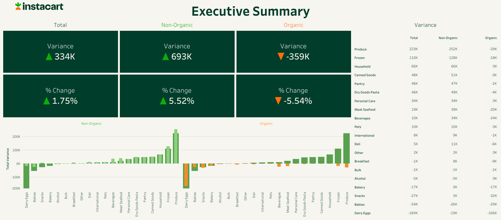
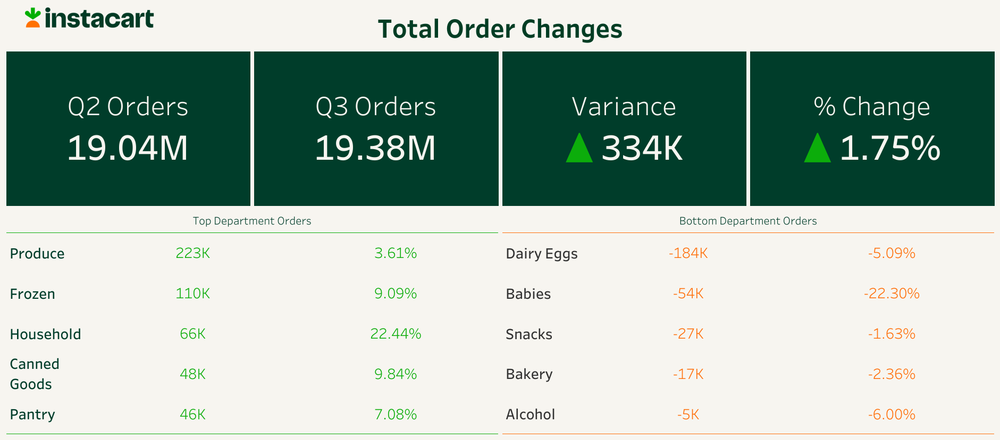
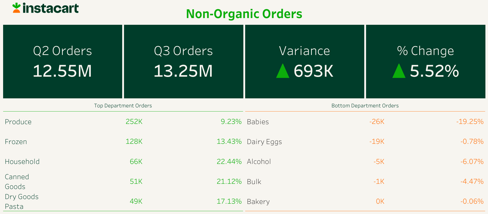
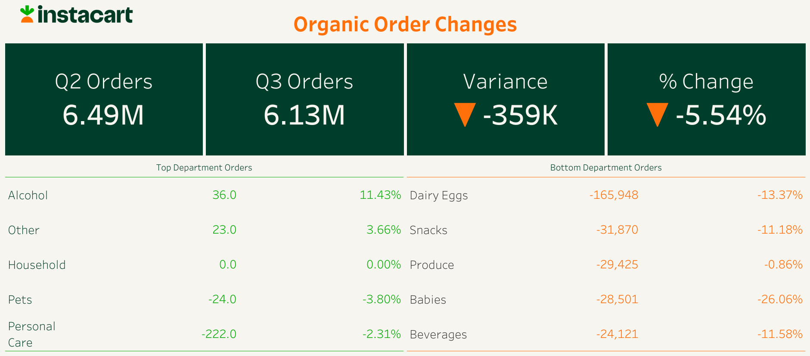

🚧 *Project under construction. Thank you for your patience!* 🚧

## Background

Instacart is a grocery deliver service founded in 2012 that curently provides service from more than 85,000 locations. Instacart delivers over 38,213 prodcuts that are grouped into 133 categories across 20 departments. Data on product orderings from Q2 and Q3 have been analyzed to identify product trends and assist in decision making.

Insights and recommendations are provided on the following key areas:

- Overall order trends by department
- Comparitive analysis of organic and non-organic product orders
- Additional interesting finds

The SQL queries used to inspect and clean the data for this analysis can be found [here](setup_queries).

Analysis SQL queries regarding various business questions can be found [here](analysis_queries).

An interactive Tableau dashboard used to report and explore customer service trends can be found [here](https://public.tableau.com/app/profile/nick.feichtel/viz/InstacartReorderAnalysis/ExecutiveSummary).

## Data

## Executive Summary

From Q2 2024 to Q3 2024 Instacart's overall orders increased by 333,587. This 1.75% increase in orders can in part be attributed to large order increases in the *Produce* and *Frozen* departments. Not all departments saw increases during the quarter, with *Dairy Eggs* and *Babies* seeing significant decreases. Overall, organic products saw large decreases in orders while non-organic products saw overall increases. Further insights into these trends and actionable recommendations are provided below.

## Detailed Analysis

### Overall Order Trends

- Orders increased from Q2 to Q3 by a modest 1.75%. In total, 13 departments saw order increases and 7 departments saw order decreases. The largest order iincreases were seen in the *Produce*, *Frozen*, and *Household* departments, while the most significant decreases were seen in the *Dairy Eggs* and *Babies* departments. 
- Orders from the *Dairy Eggs* department make up on average 18% of all of our orders. Therefore the large decrease of 184,472 orders during the quarter is concerning. Orders from the *Babies* department make up around onlt 1% of orders, but the department saw an order decrease of 22.30%, the largest percent decrease during the quarter, warranting further investigation. Decreases in these departments were significant for both organic and non-organic products, and will be explored further below.
- *Produce* orders make up roughly 32% of all orders and are up 3.5% from Q2 to Q3. Increased produce orders could be do to seasonality trends, with more produce being in-season and consumed during the Summer months. The *Frozen* department saw a 9% increase in orders. Seasonality is likely factoring in to the increases as well. Previous years data should be analyzed to see if these seasonality trends hold up or if there is a different force driving this order growth.

### Comparative Product Analysis: Organic vs. Non-Organic

- Currently, 38,213 different products can be ordered through instacart. Of the products offered, 4,107 are organic, and the rest (38,213), are non-organic. Products in the *Bulk*, *Produce*, and *Babies* department have the highest portion of their product offerings being organic at 57%, 29%, and 26% respectively. Products in the *Pets*, *Alcohol*, and *Household* department have the lowest portion of their product offerings being organic at 3%, 2%, and <1% respectively.

 

- From Q2 to Q3, 15 departments saw increases in non-organic products and 5 departments saw decreases. Of the departments that saw positive increases in non-organic products, 9 of them saw increases in orders of more than 30,000. Similar to the overall trends, the *Produce*, *Frozen*, and *Household* departments saw the greatest increase in product orders, while the *Dairy Eggs*, *Babies*, and *Alcohol* departments saw the largest decreases in product orders.
- Within the *Produce* department, 4 of the 5 product categories saw increases in both non-organic and organic products. Only fresh fruit porducts saw an overall decline in orders and this was due to a large decrease of 66,884 organic orders. **"Produce" contiues to be our strogest department, and does not seem to be greatly impacted by decrease in organic orders trend that we have been seeing.**
- Within the *Frozen* department, 10 of the 11 product categories saw overall increases in orders. Interestingly, 9 of the 11 product categories saw decreases in organic orders ranging from -4% to -37%. The decrease in organic products ordered in the *Frozen* department was offset by large increases in non-organic *Frozen* products ranging from 5% to 47%. **Non-Organic products continue to make-up for the loses in Organic orders.**
- *Household* products make up only 1.5% of orders, but its 22% increase in orders is still noteworthy. Organic products make up only 0.22% of offered *Household* products. The cleaning products category saw the largest increase in orders at nearly 10,000.

 

- From Q2 to Q3, 17 departments saw decreases in organic orders, and the 3 departments that saw increases in organic orders saw a combined increase of a neglible 59 orders. **A shift away from organic products is a trend that should be continued to be monitored.** 
- All product categories within the *Dairy Eggs* department saw a drop in organic orders except for eggs. Eggs is the only product to see increases in both organic (+3%) and non-organic (+11%) orders resulting in an overall 7% order increase. Two product categories within *Dairy Eggs* that saw a large decrease in both organic and non-organic products were yogurt and milk. Yogurt saw its orders decrease by 11% (105k orders) in Q3, while milk saw a 13% (88.7k orders) reduction Inflation causing higher dairy prices could be to blame for the drop in milk and yogurt puchases, but egg orders appear to be unaffected by this trend.
- The *Babies* department saw a nearly 54k decrease in orders with this decreases being approximately split evenly between organic and non-organic orders. The baby food formula category makes up 99.4% of the decrease in its department. We should see if our pricing algins with other competitors and research what additional factors could be impacting baby formula orders.

### Additional Interesting Finds

- Across the *Alcohol* department all prodcut categories saw a decline. Drinks in the *Beverages* department that can be seen as alcohol alternatives, such as sparkling water, soft drinks, and juices all saw modest increases. This could be related to the recent trend of consumers lvinig an increasingly sober lifestyle. Another factor to consider is that services that specialize in alcohol deliveries might have a higher share of the alcohol delivery market.

## Recommendations

- Work with marketing on seasonal promotions (end of quarter cleaning. Start the new quarter off on a clean note)

## Assumptions and Caveats

